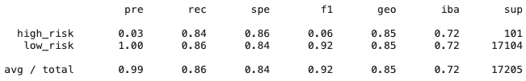

# Credit_Risk_Analysis

## Purpose
Using loan statistics data from Quarter 1, 2019 from LendingClub, machine learning models will be applied to analyze the data. The performance of each of the models will be reviewed. 

The models being reviewed are: 
* Oversampling
* Smote Oversampling
* Undersamply
* Combination (Smoteen)
* Balanced Random Forest Classifier
* Easy Ensemble AdaBoost Classifier

## Results

The following sections detail the balanced accuracy score, precision and recall scores of the the 6 machine learning models used in this analysis.

### Oversampling
Balanced Accuracy Score: 0.8377

Imbalanced Classification Report: 

### Smote Oversampling
Balanced Accuracy Score: 0.8388

Imbalanced Classification Report: 

### Undersampling
Balanced Accuracy Score: 0.8125

Imbalanced Classification Report: 

### Combination (SMOTEENN)
Balanced Accuracy Score: 0.8487

Imbalanced Classification Report: 

### Balanced Random Forest Classifier
Balanced Accuracy Score: 0.7887

Imbalanced Classification Report: 

### Easy Ensemble AdaBoost Classifier
Balanced Accuracy Score: 0.9316

Imbalanced Classification Report: 

## Summary

### Balanced Accuracy Score
We see that the Easy Ensemble AdaBoost Classifer model has the highest accuracy score.

### Precision
We see that the precision for high_risk loans is low at about 0.02 to 0.09. However, the precision for low_risk loans are usually at 1.00. The data is imbalanced, and there are far more low_risk loans than high_risk. 

### Recall
The recall value for all models fall within .74 to .94. The Easy Ensemble AdaBoost Classifier has the highest recall here.

### Model Recommendation
The Easy Ensemble AdaBoost Classfier would be the best model to use here. The recall value is more important for loans than the precision value. We want to minimize false negatives, and the recall score is best for that scenario. If an applicant is high risk, there is a chance that the applicant defaults on the loan. At a recall score at 0.92 for high_risk loans, the Easy Ensemble is the best model to use.
